<div align="center">

# 🎯 Stereo Vision Project

**Full stereo vision pipeline — from camera calibration to dense 3D reconstruction**


</div>

---

## 📖 Overview

This project implements a **complete stereo vision pipeline** using two synchronized cameras and a chessboard calibration target. Starting from raw stereo image pairs, it covers every stage of the 3D perception chain:

1. **Intrinsic calibration** of each camera individually
2. **Extrinsic (stereo) calibration** to recover the relative pose between the two cameras
3. **Stereo rectification** to align epipolar lines horizontally
4. **Disparity map computation** using the StereoSGBM algorithm
5. **3D point cloud reconstruction** with Open3D

> Developed as part of a Computer Vision course at **Polytech Dijon** (Robotics Engineering, Year 4), supervised by **Yohan Fougerolle**.

---

## 🗂️ Project Structure

```
Stereo-Vision-Project/
│
├── calib_dataset/              # Stereo image pairs used for calibration (chessboard)
├── test_disparity/             # Test image pairs for disparity & 3D reconstruction
│
├── stereo_capture_calib.py     # Capture calibration image pairs from live cameras
├── stereo_capture_disparity.py # Capture test image pairs for disparity estimation
│
├── calib_intrinsic.py          # Per-camera intrinsic calibration (camera matrix + distortion)
├── calib_extrinsic.py          # Stereo extrinsic calibration (R, T, E, F matrices)
├── rectify_calib.py            # Compute & save rectification maps (stereoRectify)
├── rectify_disparity.py        # Apply rectification to test image pairs
├── disparity.py                # StereoSGBM disparity map + Open3D 3D reconstruction
│
└── venv/                       # Python virtual environment (not tracked)
```

---

## 🔄 Pipeline Architecture

```
[Left Camera]  ──┐
                 ├──► Intrinsic Calibration ──► Stereo Calibration ──► Rectification
[Right Camera] ──┘                                                          │
                                                                            ▼
                                                               Rectified Stereo Pair
                                                                            │
                                                                            ▼
                                                               StereoSGBM Disparity Map
                                                                            │
                                                                            ▼
                                                               3D Point Cloud (Open3D)
```

---

## 📷 Hardware Setup

| Component | Details |
|---|---|
| **Camera (×2)** | Logitech C270 HD Webcam |
| **Resolution** | 720p (1280×720) |
| **Interface** | USB 2.0 |
| **Calibration pattern** | Printed chessboard |
| **OS** | Ubuntu 24.04 (tested) |

> Both cameras are mounted on a rigid rig to maintain a fixed baseline. The measured baseline after stereo calibration is approximately **T ≈ 116.8 mm**.

---

## 📐 Calibration Results

Calibration was performed using **20 stereo image pairs** of a chessboard pattern.

### Intrinsic Parameters

| | Left Camera | Right Camera |
|---|---|---|
| **fx** | 1173.4 px | 1145.2 px |
| **fy** | 1179.3 px | 1152.8 px |
| **cx** | 525.5 px | 509.4 px |
| **cy** | 265.4 px | 264.2 px |
| **Mean reprojection error** | 0.2502 px | 0.2640 px |
| **RMS error** | 0.2983 px | 0.3172 px |

### Stereo Extrinsic Parameters

```
Stereo RMS: 0.384 px   ✅ (excellent — below 0.5 px threshold)

R ≈ [[ 0.9996, -0.0104, -0.0248 ],     # Nearly identity — cameras are well aligned
     [ 0.0127,  0.9956,  0.0931 ],
     [ 0.0237, -0.0933,  0.9954 ]]

T ≈ [[ 116.8 mm ],    # Horizontal baseline
     [   2.2 mm ],    # Negligible vertical offset
     [  -9.6 mm ]]    # Negligible depth offset
```

> A stereo RMS below **0.5 px** indicates a high-quality calibration suitable for accurate depth estimation.

---

## 🚀 Getting Started

### Prerequisites

- Python 3.10+
- Two USB cameras (or a stereo camera rig)
- A printed chessboard calibration pattern

### Installation

```bash
# 1. Clone the repository
git clone https://github.com/Achraf-af10/Stereo-Vision-Project.git
cd Stereo-Vision-Project

# 2. Create and activate a virtual environment
python -m venv venv
source venv/bin/activate        # Linux / macOS
# venv\Scripts\activate         # Windows

# 3. Install dependencies
pip install opencv-python numpy open3d
```

### Running the Pipeline

```bash
# Step 1 — Capture calibration image pairs (press SPACE to save, Q to quit)
python stereo_capture_calib.py

# Step 2 — Compute intrinsic parameters for each camera
python calib_intrinsic.py

# Step 3 — Compute extrinsic (stereo) calibration
python calib_extrinsic.py

# Step 4 — Compute rectification maps
python rectify_calib.py

# Step 5 — Capture test pairs for disparity
python stereo_capture_disparity.py

# Step 6 — Rectify test pairs and compute disparity + 3D reconstruction
python rectify_disparity.py
python disparity.py
```

---

## 📸 Demo

The full pipeline is illustrated below across its five major stages.

---

### 1️⃣ Intrinsic Calibration — Reprojection Validation

After computing each camera's intrinsic matrix and distortion coefficients, detected corners (🟢 green) are compared against reprojected points (🔴 red) for every calibration image. A tight overlap confirms a good calibration.

> 📷 *Left camera — Mean error: 0.2502 px | Right camera — Mean error: 0.2640 px*

| Left Camera | Right Camera |
|:-:|:-:|
| 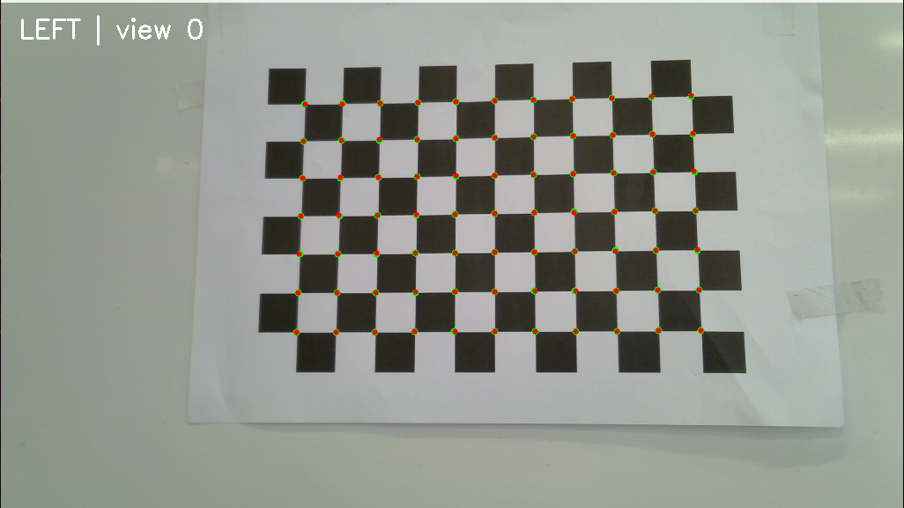 | 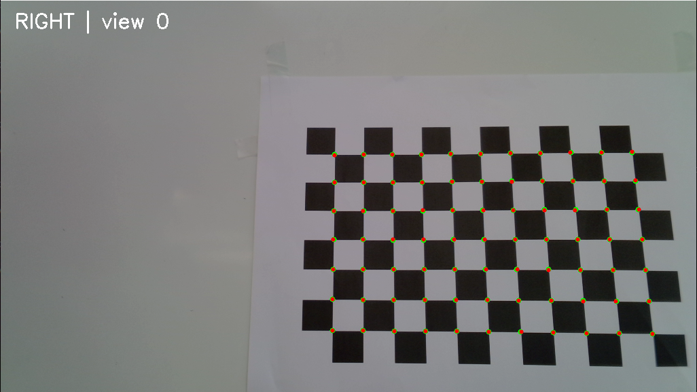 |

---

### 2️⃣ Extrinsic Calibration — Epipolar Line Verification

Once stereo calibration is complete, epipolar lines are drawn on both images. A point selected in the left image (🟢) must lie exactly on its corresponding epipolar line in the right image — and vice versa. This verifies the accuracy of the Fundamental matrix **F**.

> 📷 *Stereo RMS: 0.384 px ✅*

| Left — Epipolar Lines | Right — Epipolar Lines |
|:-:|:-:|
| 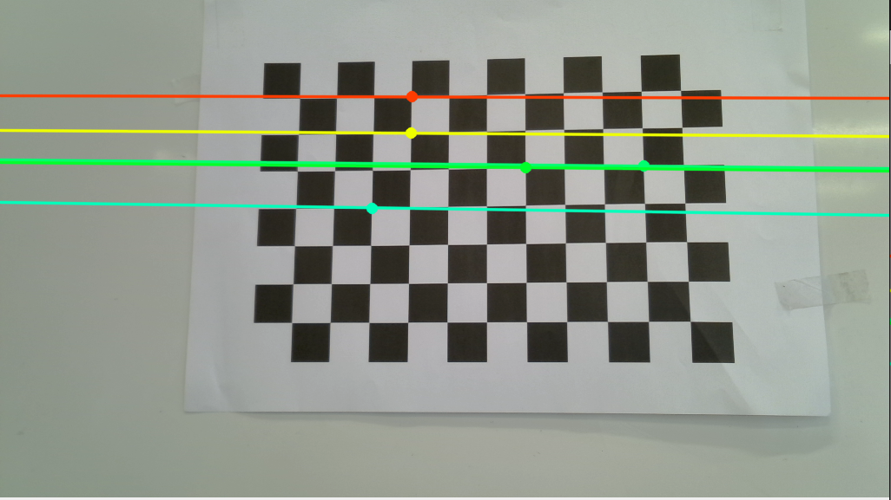 | 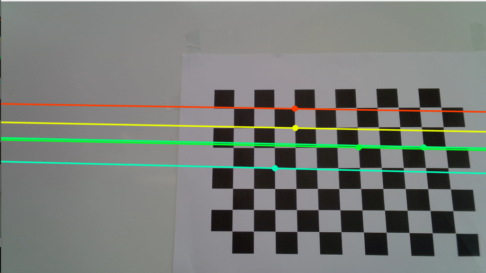 |

---

### 3️⃣ Stereo Rectification

Rectification warps both images so that epipolar lines become perfectly horizontal. This is a prerequisite for efficient disparity computation. Results are shown for both the chessboard calibration pairs and real scene images.

**Chessboard pairs (calibration dataset)**

| Before Rectification | After Rectification |
|:-:|:-:|
| 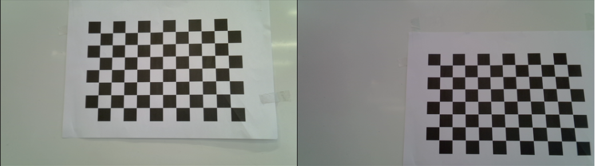 | 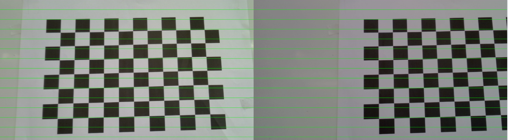 |

**Real scene images (test object)**

| Before Rectification | After Rectification |
|:-:|:-:|
| 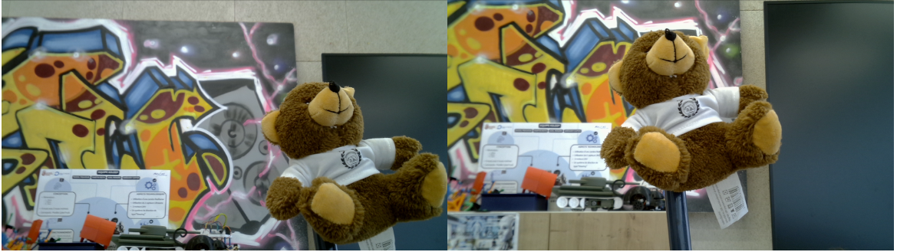 | 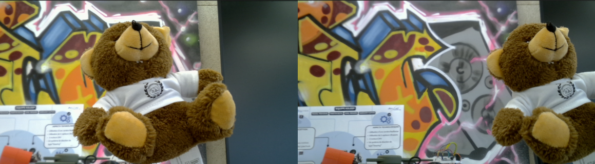 |

> 💡 Horizontal colored lines overlaid on rectified pairs confirm that corresponding features are perfectly aligned row-by-row.

---

### 4️⃣ Disparity Map

The StereoSGBM algorithm computes a dense disparity map from the rectified stereo pair. Brighter regions correspond to closer objects (larger disparity), darker regions to farther ones.

| Rectified Left | Rectified Right | Disparity Map |
|:-:|:-:|:-:|
| 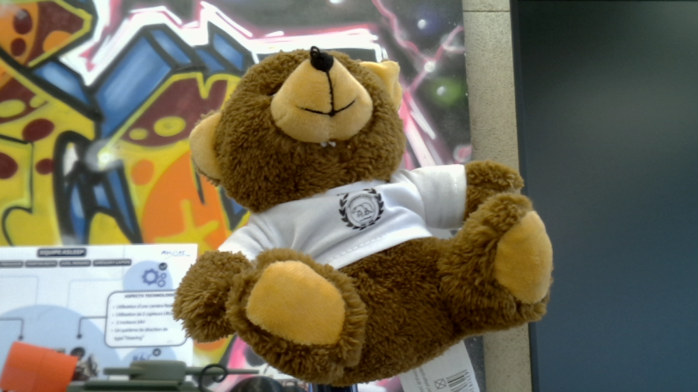 | 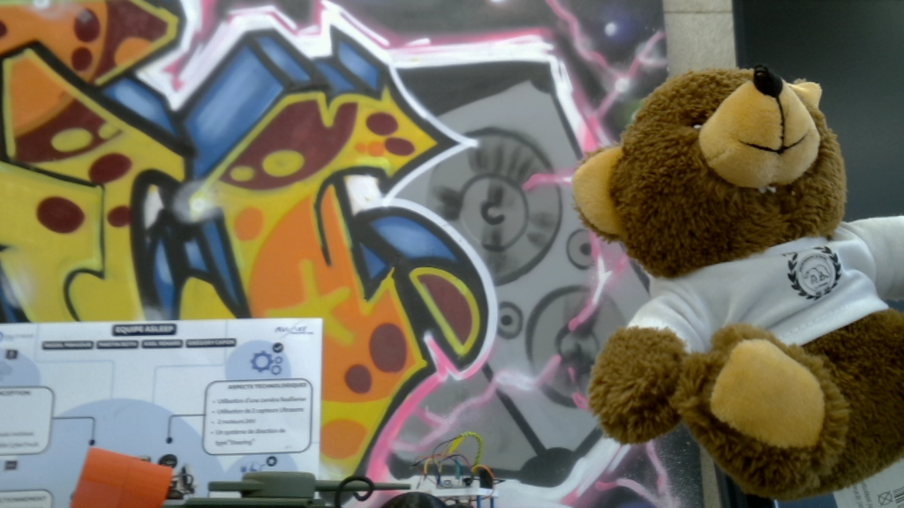 | 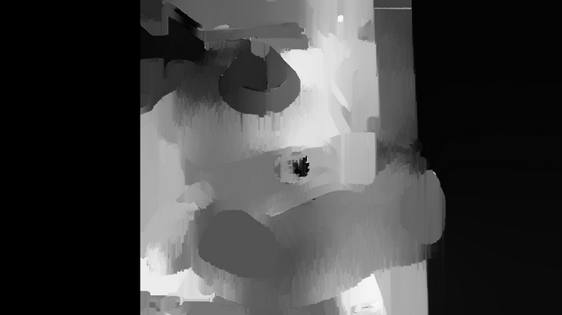 |

---

### 5️⃣ 3D Point Cloud Reconstruction

The disparity map is back-projected into 3D using the **Q** reprojection matrix from `stereoRectify`. The resulting point cloud is visualized with Open3D.

| Point Cloud (front view) | Point Cloud (side view) |
|:-:|:-:|
| 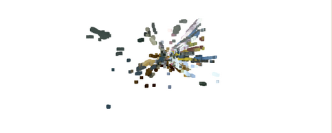 | 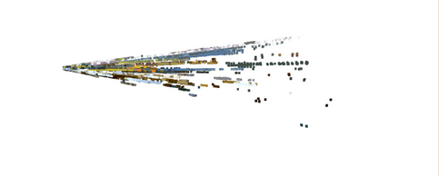 |

---

## ⚙️ Key Parameters

| Parameter | Location | Description |
|---|---|---|
| `CHESSBOARD_SIZE` | `calib_intrinsic.py` | Inner corners of the calibration pattern (e.g. `(9, 6)`) |
| `SQUARE_SIZE` | `calib_intrinsic.py` | Physical size of one square in mm |
| `numDisparities` | `disparity.py` | StereoSGBM — must be a multiple of 16 |
| `blockSize` | `disparity.py` | StereoSGBM matching block size (odd number) |
| Camera indices | `stereo_capture_*.py` | Adjust `cv2.VideoCapture(0/1)` to match your setup |

---

## 🛠️ Dependencies

| Library | Purpose |
|---|---|
| `opencv-python` | Camera capture, calibration, rectification, StereoSGBM |
| `numpy` | Matrix operations and data handling |
| `open3d` | 3D point cloud generation and visualization |

---


## 👥 Team

This project was developed by three engineering students from **Polytech Dijon** (Robotics, Year 4).

| Name | GitHub |
|---|---|
| **Achraf AHMED FOUATIH** | [](https://github.com/Achraf-af10) |
| **Lyes AIBOUD** | [](https://github.com/Lyes-aib) |
| **Reina HALABY** | [](https://github.com/Reina1234554) |

---

<div align="center">
<sub>Built with 🔬 and OpenCV · Polytech Dijon 2025</sub>
</div>
